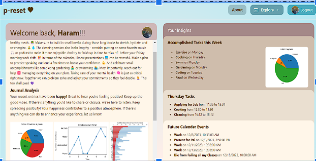

# p-reset
FA23: p-reset (AI-powered Personalized Self-Care Web Application)


#### Home Page



### Description
 This project will create a fully functional self care web application with AI-based recommendations for personal wellness, incorporating features such as break reminders, habit and mood tracking, journaling, and calendar integration. Combining both software engineering and traditional data science elements, we will also implement smart scheduling of wellness activities, use NLP techniques to analyze journal entries, and develop personalized visualizations from user data. The aim is to have an assistant that learns from a user’s past activity to make smart recommendations and optimize time management to include self care tasks.

 The p-reset application is a unique blend of software engineering and traditional data science methodologies, designed to deliver a personalized self-care experience. It leverages a variety of cutting-edge technologies to provide intelligent recommendations and perform comprehensive user data analysis. 

 The p-reset application utilizes a full-stack development approach, combining both frontend and backend technologies:

- **Frontend:** Next.js (React framework), Tailwind CSS
- **Backend:** Python, Flask, Sci-kit Learn, NLTK, Pandas, NumPy
- **Database:** PostgreSQL with SQLAlchemy

The application also integrates with the Google Calendar API to provide a seamless scheduling experience.

### Features

- **Personalized Recommendations:** The application provides personalized recommendations for self-care activities based on the user's mood, habits, and schedule. The recommendations are generated using a combination of machine learning and natural language processing techniques, including sentiment analysis and topic modeling.

- **Smart Scheduling:** The application automatically schedules self-care activities on the user's calendar, taking into account the user's availability and preferences. The scheduling algorithm is based on a combination of reinforcement learning and genetic algorithms.

- **Comprehensive Data Analysis:** The application performs comprehensive analysis of the user's data, including mood and habit tracking, journal entries, and calendar events. The analysis is performed using a combination of machine learning and natural language processing techniques, including sentiment analysis and topic modeling.

- **Personalized Visualizations:** The application generates personalized visualizations based on the user's data, including mood and habit tracking, journal entries, and calendar events. The visualizations are generated using a combination of machine learning and natural language processing techniques, including sentiment analysis and topic modeling.

- **Calendar Integration:** The application integrates with the user's Google Calendar to provide a seamless scheduling experience. The user can view their calendar events and add new events directly from the application.

- **Habit Tracking:** The application allows the user to track their habits and view their progress over time. The user can also set goals for their habits and receive notifications when they reach their goals.

- **Mood Tracking:** The application allows the user to track their mood and view their mood over time. The user can also set goals for their mood and receive notifications when they reach their goals.

- **Journaling:** The application allows the user to journal about their day and view their journal entries over time. The user can also set goals for their journal entries and receive notifications when they reach their goals.

- **User Authentication:** The application allows the user to sign up and log in using their Google account. The user can also log out of the application at any time.


## Prerequisites

Before running the application on your local machine, ensure you have the following prerequisites:

1. **PostgreSQL Database:** Set up a PostgreSQL database and note down the connection details (database name, username, password, etc.).

2. **Google API Credentials:** Obtain your own Google API credentials, including the client ID and client secret, to enable calendar integration.

## Getting Started

### Step 1: Clone the Repository

```bash
git clone https://github.com/yourusername/p-reset.git
cd p-reset
```

### Step 2: Set Up Virtual Environment
```bash
pip install virtualenv
virtualenv venv
# On Windows
venv\Scripts\activate
# On Unix or MacOS
source venv/bin/activate
```

### Step 3: Install Dependencies
```bash
pip install -r requirements.txt
```

### Step 4: Set Up Environment Variables
```bash
# PostgreSQL database connection details
DB_NAME=your_db_name
DB_USER=your_db_user
DB_PASSWORD=your_db_password
DB_HOST=your_db_host
DB_PORT=your_db_port

# Google API credentials
GOOGLE_CLIENT_ID=your_client_id
GOOGLE_CLIENT_SECRET=your_client_secret

# Flask secret key for sessions
SECRET_KEY=your_secret_key
```

### Step 5: Run the Application
```bash
python app.py
```


 ### People
Sumi Vora     
Vivien Song
Haram Yoon
Abrar Yaser

Erin Li
Mohamed Hamouda